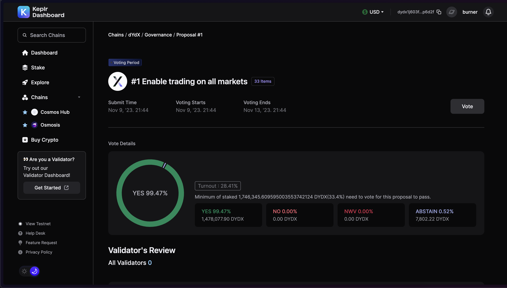

# How to Vote Guide

## Overview

Below, we provide a step-by-step guide to explain to new users of the dYdX Chain how to cast a vote on a governance proposal through a wallet extension.

Note, only bonded DYDX tokens can vote on dYdX Chain governance proposals, and this guide was created with the assumption that you have bonded DYDX tokens.&#x20;

To get bonded DYDX tokens, you will need to stake your tokens to your preferred validator(s). Visit this [page](../staking/how-to-stake-guide.md) for further information on staking.

## Keplr

1. First, go to [Keplr Dashboard](https://wallet.keplr.app/). Once you can see the dashboard page, enter “dYdX” on the “Search Chains” bar on the upper left corner of the page.&#x20;

<figure><figcaption></figcaption></figure>

2. Then click “dYdX” and you will be taken to dYdX dashboard.

<figure><figcaption></figcaption></figure>

3. Click the “Governance” tab, you will find all the information about current and past on-chain proposals.

<figure><figcaption></figcaption></figure>

4. Proposals  that you can vote on are marked with the “Voting Period” tag.

<figure><figcaption></figcaption></figure>

5. In case you have not had time to check out the [dYdX community forum](https://dydx.forum), you can read the full details of the proposal by clicking on the respective proposal.

<figure><figcaption></figcaption></figure>

6. In the proposal page, you can find the Title, Proposal Timeline, Vote Details, Validator’s Review and Proposal Details.&#x20;

<figure><figcaption></figcaption></figure>

7. Once you read the full description of the proposal, you can cast your vote by clicking the “Vote” button on the right side of the page.

<figure><figcaption></figcaption></figure>

8. A pop-up of vote options will appear: `Yes`, `No`, `Abstain`, and `No With Veto`. To understand the difference between these options, you can visit the [Governance Module ](./#proposal-voting-options)documentation.&#x20;

<figure><figcaption></figcaption></figure>

8. Once you have selected your preferred option, you can click "Confirm".

<figure><figcaption></figcaption></figure>

8. Keplr will prompt you to confirm the transaction, as well as show the transaction fee to cast the vote. After reviewing your selection and transaction fee, you can click "Approve".

<figure><figcaption></figcaption></figure>

\
