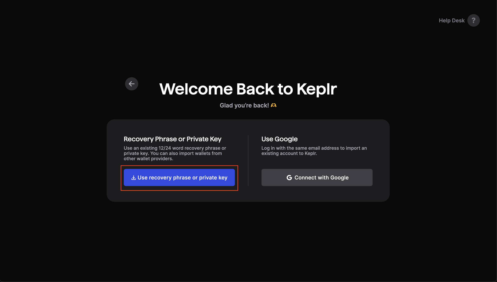

# How to Stake Guide

## Overview

Below, we provide a step-by-step guide to explain to new users of the dYdX Chain how to onboard to Keplr and how to stake DYDX to validators on the dYdX Chain.

## Summary

* All Users
  * [_Step 0 - Follow this guide to bridge ethDYDX from Ethereum to the dYdX Chain_](how-to-stake-guide.md#step-0-follow-this-guide-to-bridge-ethdydx-from-ethereum-to-the-dydx-chain)
* New Keplr User
  * [_Step 1 - Onboard with Keplr wallet to access the staking dashboard_](how-to-stake-guide.md#step-1-onboard-to-keplr-wallet-to-access-a-staking-dashboard)
* Existing Keplr User
  * [_Step 2 - Preparing to import an existing wallet on Keplr_](how-to-stake-guide.md#step-2-preparing-to-import-an-existing-wallet-on-keplr)
  * [Step 3 - Export secret phrase from the bridge interface](how-to-stake-guide.md#step-3-export-secret-phrase-from-the-bridge-interface)
  * [Step 4 - Set up your Keplr wallet ](how-to-stake-guide.md#step-4-set-up-your-keplr-wallet)
  * [Step 5 - Stake DYDX to dYdX Chain](how-to-stake-guide.md#step-5-stake-dydx-to-dydx-chain)

## All Users&#x20;

### _Step 0 - Follow this_ [_guide_](../../migration-of-dydx-from-ethereum-to-dydx-chain/how-to-bridge-guide.md) _to bridge ethDYDX from Ethereum to the dYdX Chain_

## New Keplr User

dYdX community members have the option to access a staking dashboard on Keplr. If you choose to participate in staking, you could export your secret phrase to a Keplr wallet and subsequently stake or vote via the Keplr Dashboard.

### _Step 1 - Onboard to Keplr wallet to access a staking dashboard_

<figure><figcaption></figcaption></figure>

* 1(a) If you are a new user of the Keplr wallet, before exporting the secret phrase, you should install the[ Keplr browser extension](https://www.keplr.app/download) to your compatible browser.

## Existing Keplr User

### _Step 2 - Preparing to import an existing wallet on Keplr_

<figure><figcaption></figcaption></figure>

* 2(a) Once Keplr wallet is installed, select “Import an existing wallet”.

<figure><figcaption></figcaption></figure>

* 2(b) select “Use recovery phrase or private key”.

<figure><figcaption></figcaption></figure>

* 2(c) select “24 words” on the Import Existing Wallet page.

### _Step 3 - Export secret phrase from the bridge interface_

dYdX Chain users can export their secret phrase from the bridge interface operated by the dYdX Operations subDAO.&#x20;

<figure><figcaption></figcaption></figure>

* 3(a) Visit [https://bridge.dydx.trade/](https://bridge.dydx.trade/) and connect your Ethereum wallet to export your secret phrase.

<figure><figcaption></figcaption></figure>

* 3(b) Navigate to the drop-down options on the top right-hand corner of your screen and select “Export secret phrase”.
* **Note: if exporting a secret phrase, ensure it is kept highly secure. Anyone with access to the secret phrase can control all assets in the wallet, so it’s strongly recommended that this process is done on a secure computer.**

<figure><figcaption></figcaption></figure>

* 3(c) Check the box to acknowledge that your understand the risks and click ‘Reveal secret phrase’.

<figure><figcaption></figcaption></figure>

* 3(d) Click the “Click to show” box.

<figure><figcaption></figcaption></figure>

* 3(e) After revealing the secret phrase, click “Copy”. Make sure you remember and securely store your secret phrase.

### _Step 4 - Set up your Keplr wallet_

<figure><figcaption></figcaption></figure>

* 4(a) navigate back to the Keplr Dashboard and paste the phrase into the “Import Existing Wallet'' page by selecting “Import”.
* **\*\*\*Reminder - make sure all 24 words are pasted entirely and in the correct order.**

<figure><figcaption></figcaption></figure>

* 4(b) Navigate to “Set Up Your Wallet” on Keplr and create a unique wallet name and password.

<figure><figcaption></figcaption></figure>

* 4(c) Select the dYdX Chain and click “Save”.
* Once the secret phrase is successfully imported into Keplr, the user can connect their Keplr wallet to the Keplr Dashboard to stake and vote.

### _Step 5 - Stake DYDX to dYdX Chain_

<figure><figcaption></figcaption></figure>

* 5(a) Visit [Keplr Dashboard](https://wallet.keplr.app/chains/dydx) for dYdX Chain and log in with Keplr wallet using the imported dYdX Chain account.

<figure><figcaption></figcaption></figure>

* 5(b) Open the ‘Staking’ tab on Keplr Dashboard under dYdX Chain. Here, at the bottom, you will see a list of all active validators on the dYdX Chain.

<figure><figcaption></figcaption></figure>

* 5(c) Decide the validator(s) that you want to stake to then click the arrow next to those validator(s).
* If you are not sure about the validator that you want to stake to, we encourage you to review “[A Take on Good Practices for dYdX Chain Validators and Stakers](https://www.dydx.foundation/blog/good-practices-for-dydx-chain-validators-and-stakers)”. More information about the [staking module](https://docs.dydx.community/dydx-token-migration/dydx-chain-modules-and-parameters/staking) is available in the dYdX Chain documentation.

<figure><figcaption></figcaption></figure>

* 5(d) Next, click 'Stake' to stake your DYDX tokens to those validator(s).

<figure><figcaption></figcaption></figure>

* 5(e) Enter the number of DYDX tokens you want to stake to the respective validator(s) and then click ‘Stake’.
* You can stake 100% (max) of your DYDX tokens to one validator or spread your stake across multiple validators.&#x20;

<figure><figcaption></figcaption></figure>

* 5(f) Click ‘Approve’ to confirm the staking transaction and pay the gas fee on dYdX Chain. Once that transaction is complete, you have successfully completed all steps to stake DYDX.

<figure><figcaption></figcaption></figure>

* 5(g) The validators you have staked to will appear on the top of the page on the Keplr Dashboard. You should now see your staked totals, any pending rewards to be claimed as well as options to claim rewards and manage existing delegations with each of your validators.
* 5(h) In case of a failed transaction, it could be due to the following reasons:
  * Not enough gas fee: Sending a transaction on dYdX Chain would require a certain amount of DYDX or USDC to be paid to Validators as gas fee. Note, the selection of the asset, DYDX or USDC, to pay gas will be made by the user and will need to be accepted by the validator. Make sure that you have enough DYDX or USDC to pay for the gas fee associated with the staking transaction.
  * Staking more than the available balance: Make sure that the amount you are planning to stake plus the gas fee is less than the available DYDX and/or USDC balance in your wallet.&#x20;
  * Unable to verify transaction status: While the transaction may have been successful, Keplr may be unable to verify the status of your transaction. Make sure to check your address on the block explorer and wait 5-10 minutes before attempting another transaction.
*   5(i) Important information about Staking:&#x20;

    * Unstake and the Unbonding Period: DYDX holders who stake DYDX to a validator can send a transaction to unstake and remove their tokens from being staked to a validator. After this transaction, the DYDX tokens enter an unbonding period.&#x20;
      * More information is available [here](https://www.dydx.foundation/how-to-unstake).
    * Redelegation: Instead of unstaking and waiting the unbonding period, stakers can choose to delegate 100% or a portion of their staked DYDX to a separate validator without having to wait for the unbonding period.&#x20;
      * During the redelegation process, the tokens remain staked, meaning they continue to contribute to the network's security and potentially earn rewards for the delegator.
      * However, a user’s slashing risk with the original validator remains until the unbonding period concludes. For example, a user stakes 20 DYDX to Validator A for 59 days, on day 60 the user decides to redelegate their 20 DYDX to Validator B. From days 60-90, the user is at a risk of having a portion of their 20 staked DYDX slashed based on the conduct of Validator A.&#x20;
      * After the 90th day, the slashing risk transitions to Validator B.
      * After redelegating, any DYDX that was redelegated must wait 30 days before it can be redelegated.
      *   More information is available [here](https://www.dydx.foundation/how-to-redelegate).

          \

    \

\

###
