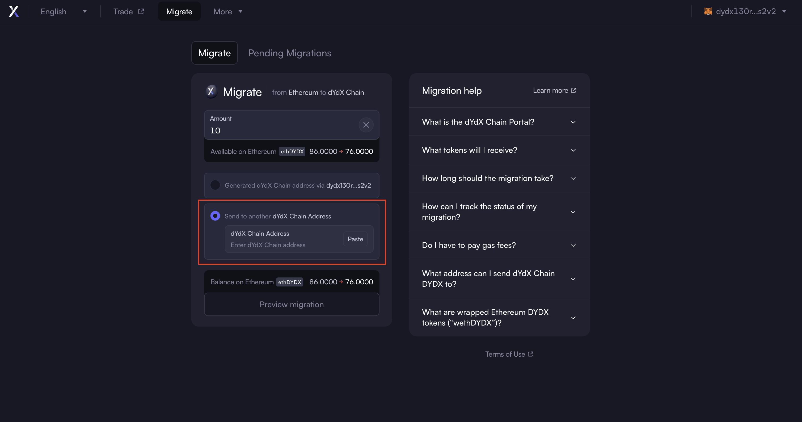

# How to Bridge Guide

<figure><figcaption></figcaption></figure>

## Overview&#x20;

Migrating your ethDYDX tokens from Ethereum to the dYdX Chain will enable you to stake in order to secure the dYdX Chain network and participate in governance on the dYdX Chain.

### Summary&#x20;

* [_Step 0_](how-to-bridge-guide.md#step-0-visit-bridge.dydx.trade-to-initiate-the-migration-process) _- Visit_ [_bridge.dydx.trade_](http://bridge.dydx.trade) _to initiate the migration process_&#x20;
* [_Step 1_](how-to-bridge-guide.md#step-1-connect-a-wallet-holding-ethdydx-to-generate-dydx-chain-address) _- Connect a wallet holding ethDYDX to generate dYdX Chain address_
* [_Step 2_](how-to-bridge-guide.md#step-2-enter-the-amount-of-ethdydx-tokens-to-migrate) _- Enter the amount of ethDYDX tokens to migrate_
* [_Step 3_](how-to-bridge-guide.md#step-3-choose-a-recipient-address-to-migrate-to-on-dydx-chain) _- Choose a recipient address to migrate to on dYdX Chain_
* [_Step 4_](how-to-bridge-guide.md#step-4-preview-migration-details) _- Preview migration details_&#x20;
* [_Step 5_ ](how-to-bridge-guide.md#step-5-authorize-the-wethdydx-smart-contract)_- Authorize the wethDYDX Smart Contract_
* [_Step 6_](how-to-bridge-guide.md#step-6-confirm-migration-by-signing-with-wallet) _- Confirm migration by signing with wallet_
* [_Step 7_ ](how-to-bridge-guide.md#step-7-check-the-status-of-your-migration)_- Check the status of your migration_

## How to migrate ethDYDX tokens to the dYdX Chain?

### _Step 0 - Visit_ [_bridge.dydx.trade_](http://bridge.dydx.trade) _to initiate the migration process_

* The dYdX Foundation does not operate any public infrastructure related to the dYdX Chain and/or the migration of ethDYDX tokens to the dYdX Chain.  However, as part of its statutory mission to support and promote the dYdX ecosystem, the dYdX Foundation has provided a URL ([bridge.dydx.trade](http://bridge.dydx.trade)) to a third-party user interface solution that facilitates the bridging of ethDYDX tokens from Ethereum to the dYdX Chain via the [wethDYDX Smart Contract](https://www.dydx.foundation/blog/exploring-the-future-of-dydx).

### _Step 1 - Connect a wallet holding ethDYDX to generate dYdX Chain address_

<figure><figcaption></figcaption></figure>

* 1(a) Acknowledge the terms before proceeding to access the interface.

<figure><figcaption></figcaption></figure>

* 1(b) On the top right corner, connect your wallet.

<figure><figcaption></figcaption></figure>

* 1(c) Select the wallet you use like Metamask, Coinbase Wallet, or others.

<figure><figcaption></figcaption></figure>

* 1(d) Your Ethereum private key is used to generate and create a network address on the dYdX Chain. Click “Send request”.

<figure><figcaption></figcaption></figure>

* 1(e) Sign the onboarding transaction on your wallet. Note that there is no gas cost associated with the onboarding process.

### _Step 2 - Enter the amount of ethDYDX tokens to migrate_

<figure><figcaption></figcaption></figure>

* 2(a) Check the balance of ethDYDX available on Ethereum and enter the number of ethDYDX tokens you want to migrate. You can select ‘max’ to migrate the entire ethDYDX balance in your Ethereum address.

### _Step 3 - Choose a recipient address to migrate to on dYdX Chain_

<figure><figcaption></figcaption></figure>

* 3(a)(i) Select ‘Generated dYdX Chain address’ to migrate the ethDYDX tokens to the dYdX Chain address automatically generated via your Ethereum private key.

**OR**

<figure><figcaption></figcaption></figure>

* 3(b)(ii) Select ‘Send to another dYdX Chain Address’ to migrate tokens to an existing dYdX Chain network address. This option can be selected in case of transfer to another wallet address hosted by a third-party custodian.
* **Please make sure to verify the dYdX Chain address before moving forward.**

### _Step 4 - Preview migration details_&#x20;

<figure><figcaption></figcaption></figure>

* 4(a) Check details, including destination address, wethDYDX balance, and expected dYdX Chain DYDX balance.

<figure><figcaption></figcaption></figure>

* 4(b) Click ‘Preview migration’ to review the migration details and review an estimated timeline for the migration process.

### _Step 5 - Authorize the wethDYDX Smart Contract_

<figure><figcaption></figcaption></figure>

* 5(a) Click “Approve allowance”.

<figure><figcaption></figcaption></figure>

* 5(b) On the wallet extension pop-up, click ‘Next’ and follow through to authorize the wethDYDX Smart Contract to spend ethDYDX token from your account.

### _Step 6 - Confirm migration by signing with wallet_

<figure><figcaption></figcaption></figure>

6(a) Review and acknowledge that you have reviewed the two check boxes. Note the following:

* **For security reasons, the settlement on dYdX Chain may take between 24-48 hours depending on dYdX Chain’s block times.**&#x20;
* **By interacting with the wethDYDX Smart Contract, your ethDYDX tokens will be permanently locked in the wethDYDX Smart Contract and irrecoverable.**&#x20;

<figure><figcaption></figcaption></figure>

* 6(b) Click ‘Confirm Migration’.

<figure><figcaption></figcaption></figure>

* 6(c) Click ‘Confirm’ on your wallet pop-up to sign and confirm the transaction.

<figure><figcaption></figcaption></figure>

* 6(d) Your Ethereum transaction should be finalized in approximately 25 minutes.

### _Step 7 - Check the status of your migration_

<figure><figcaption></figcaption></figure>

* 7(a) After the transaction finalizing time on the Ethereum network has elapsed, you will find the pending migration in the 'Pending Migrations' tab.

<figure><figcaption></figcaption></figure>

* 7(b) You can filter the table by pasting your dYdX Chain address to see all of your pending migrations or click the ‘Mine’ sub-tab to see your transaction(s) only.

_Once the pending migration has settled on the dYdX Chain, you will no longer see a pending migration transaction in the table. You can refresh the page to initiate a new migration process._
